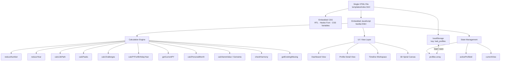
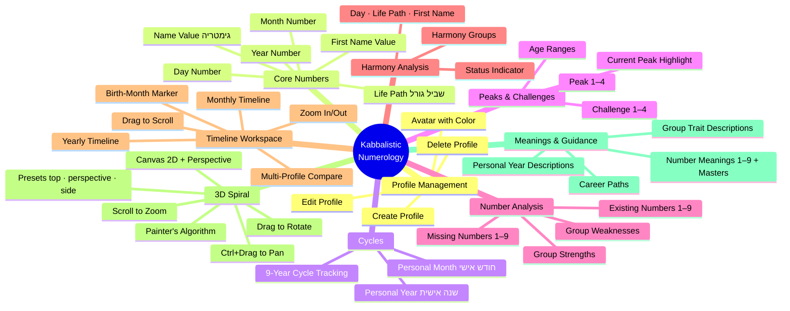
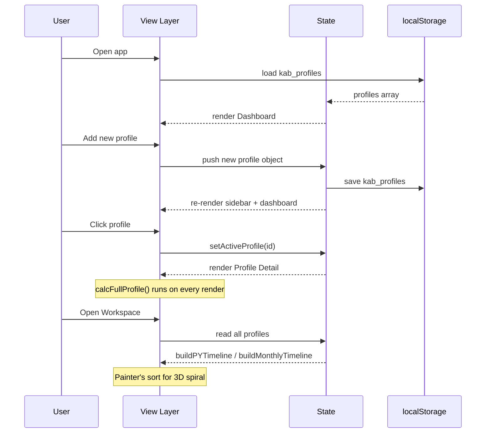

# Kabbalistic Numerology App

> A fully self-contained, offline-first Hebrew numerology calculator based on **Kabbalistic** (not Pythagorean) principles. Single HTML file — no server, no build step, no dependencies.

---

## Table of Contents

1. [Overview](#overview)
2. [Architecture](#architecture)
3. [Feature Map](#feature-map)
4. [Calculation Engine](#calculation-engine)
   - [Core Reduction Rules](#core-reduction-rules)
   - [Life Path](#life-path)
   - [Personal Year & Month](#personal-year--month)
   - [Peaks & Challenges](#peaks--challenges)
   - [Existing & Missing Numbers](#existing--missing-numbers)
   - [Name–Date Harmony](#namedate-harmony)
5. [Data Flow](#data-flow)
6. [Views](#views)
   - [Dashboard](#dashboard)
   - [Profile Detail](#profile-detail)
   - [Timeline Workspace](#timeline-workspace)
   - [3D Spiral](#3d-spiral)
7. [Hebrew Gematria Table](#hebrew-gematria-table)
8. [Master Numbers](#master-numbers)
9. [Number Meanings Reference](#number-meanings-reference)
10. [Roadmap](#roadmap)
11. [Tech Stack](#tech-stack)

---

## Overview

This application provides a complete **Kabbalistic numerology** reading for any person based on their date of birth and Hebrew first name. It calculates all core numerological indicators, displays them in an elegant RTL Hebrew interface, and lets practitioners manage multiple client profiles from a single dashboard.

**Key principles:**
- Kabbalistic system only (not Pythagorean)
- Master numbers `11`, `22`, `33` are **never reduced** in fate-path calculations
- Hebrew gematria for name values (final letters = same value as regular form)
- Fully offline — data stored in `localStorage`
- Zero external dependencies (no React, no Vue, no jQuery)

---

## Architecture



---

## Feature Map



---

## Calculation Engine

### Core Reduction Rules

| Function | Behaviour |
|---|---|
| `reduceNumber(n)` | Sum digits repeatedly until single digit **or** master (11 / 22 / 33) |
| `reducePY(n)` | Sum digits repeatedly until **1–9 only** (masters are reduced) |
| `reduceYear(year)` | Sum 4 digits → `reduceNumber` |

### Life Path

```
d  = reduceNumber(birthDay)
m  = reduceNumber(birthMonth)
y  = reduceYear(birthYear)
LP = reduceNumber(d + m + y)
```

Master numbers are preserved at every intermediate step.

### Personal Year & Month

**Birth-month rule:**
- January–June → use `calYear` itself
- July–December → use `calYear + 1`

```
calcPYForBirthdayYear(birthDay, birthMonth, calYear):
  d  = reduceNumber(birthDay)
  m  = reduceNumber(birthMonth)
  y  = birthMonth <= 6 ? reduceYear(calYear) : reduceYear(calYear + 1)
  PY = reducePY(d + m + y)          ← always 1–9

getCurrentPY(birthDay, birthMonth, checkDate):
  lastBirthdayYear = checkDate >= birthday(checkDate.year)
                     ? checkDate.year
                     : checkDate.year - 1
  return calcPYForBirthdayYear(birthDay, birthMonth, lastBirthdayYear)

PersonalMonth = reducePY(personalYear + currentCalendarMonth)
```

### Peaks & Challenges

```mermaid
flowchart LR
    D[Day<br/>reduced] & M[Month<br/>reduced] & Y[Year<br/>reduced] & LP[Life Path]

    D & M --> P1[Peak 1<br/>d+m]
    D & Y --> P2[Peak 2<br/>d+y]
    D & LP --> P3[Peak 3<br/>d+LP]
    M & Y --> P4[Peak 4<br/>m+y]

    D & M --> C1[Challenge 1<br/>|d−m|]
    D & Y --> C2[Challenge 2<br/>|d−y|]
    C1 & C2 --> C3[Challenge 3<br/>|c1−c2|]
    M & Y --> C4[Challenge 4<br/>|m−y|]
```

**Peak age ranges** — start age `s = 27 − LP` (masters: 11→2, 22→4, 33→6):

| Period | Age Range |
|---|---|
| Peak 1 | s … s+8 |
| Peak 2 | s+9 … s+17 |
| Peak 3 | s+18 … s+26 |
| Peak 4 | s+27 … s+35 |

### Existing & Missing Numbers

Source: all digits in the string `"${day}${month}${year}"`.

- **Existing** — digits 1–9 that appear at least once
- **Missing** — digits 1–9 that do not appear

Groups (both existing-strengths and missing-weaknesses):

| Group | Theme |
|---|---|
| 1-2-3 | Order, logic, leadership |
| 4-5-6 | Dependence, nostalgia, sensuality |
| 7-8-9 | Persistence, independence, drive |
| 1-4-7 | Reliability, action over words |
| 2-5-8 | Social ease, emotional balance |
| 3-6-9 | Memory, logic, creativity |
| 1-5-9 | Judgment, problem-solving |
| 3-5-7 | Self-awareness, spirituality |

### Name–Date Harmony

Three numbers are compared: `dayNum`, `lifePathNum`, `firstNameValue`.

Master normalisation for grouping: `11→2, 22→4, 33→6`.

Harmony condition:
1. At least **2 of the 3** numbers share a harmony group, **and**
2. The third number's difference from each of the two shared numbers is **≤ 2**

---

## Data Flow



---

## Views

### Dashboard

Grid of profile cards, each showing:
- Avatar (initials + deterministic colour)
- Life Path, Day Number, Personal Year badge
- Hover → edit / delete actions

### Profile Detail

Full reading for one person:
- Hero bar: Life Path, Personal Year, Personal Month
- Core numbers: day / month / year (raw + reduced)
- Peaks & Challenges pairs with current-period highlight
- Existing / missing numbers chips
- Harmony status
- Number meaning, career path, personal year description

### Timeline Workspace

Horizontal scrollable table — one row per person, one column per year (or month).

- Each cell = colour-coded Personal Year block
- Pre-birth cells shown as hatched pattern
- Current year highlighted with ring
- Zoom controls (cell width)
- Drag-to-scroll
- Profile picker (multi-select, up to 8)
- Toggle yearly ↔ monthly view

### 3D Spiral

Canvas-based 3D helix (no WebGL, no libraries):

```
x = r · cos(angle)
y = −t · Y_RISE
z = r · sin(angle)
```

- Painter's algorithm depth sort
- Mouse drag → camera rotation
- Ctrl + drag → pan
- Scroll wheel → zoom
- Preset views: `top`, `perspective`, `side`

---

## Hebrew Gematria Table

| Letter | Value | | Letter | Value |
|---|---|---|---|---|
| א | 1 | | י | 10 |
| ב | 2 | | כ / ך | 20 |
| ג | 3 | | ל | 30 |
| ד | 4 | | מ / ם | 40 |
| ה | 5 | | נ / ן | 50 |
| ו | 6 | | ס | 60 |
| ז | 7 | | ע | 70 |
| ח | 8 | | פ / ף | 80 |
| ט | 9 | | צ / ץ | 90 |
|   |   | | ק | 100 |
|   |   | | ר | 200 |
|   |   | | ש | 300 |
|   |   | | ת | 400 |

> Final letters (sofit) carry the **same value** as their regular form.

---

## Master Numbers

| Number | Reduced to | Context |
|---|---|---|
| 11 | preserved | Life path, peaks, challenges |
| 22 | preserved | Life path, peaks, challenges |
| 33 | preserved | Life path, peaks, challenges |
| 11/22/33 | 2 / 4 / 6 | Personal Year, Personal Month (`reducePY`) |
| 11/22/33 | 2 / 4 / 6 | Harmony group normalisation |
| 11/22/33 | 2 / 4 / 6 | Peak age calculation |

---

## Number Meanings Reference

| # | Core Trait |
|---|---|
| 1 | Leadership, independence, decisiveness |
| 2 | Emotion, partnership, sensitivity |
| 3 | Creativity, expression, romance |
| 4 | Discipline, perfectionism, structure |
| 5 | Freedom, travel, charisma |
| 6 | Family, harmony, warmth |
| 7 | Spirituality, intuition, guidance |
| 8 | Authority, abundance, balance of matter & spirit |
| 9 | Verbal power, justice, prophecy |
| 11 | Master 2 — heightened sensitivity & intuition |
| 22 | Master 4 — builder of great visions |
| 33 | Master 6 — unconditional love & giving |

---

## Roadmap

- [ ] Supabase backend — user accounts, cloud profiles
- [ ] Vercel deployment — accessible from any device
- [ ] Mobile-responsive layout
- [ ] PWA — "Add to Home Screen" on iPhone
- [ ] PDF export of full reading
- [ ] Compatibility report between two profiles
- [ ] Notifications for Personal Year transitions

---

## Tech Stack

| Layer | Technology |
|---|---|
| Markup | HTML5 |
| Styling | Vanilla CSS (custom properties, CSS Grid, Flexbox) |
| Logic | Vanilla JavaScript ES6+ |
| Font | Heebo (Google Fonts) |
| Graphics | HTML5 Canvas 2D |
| Storage | localStorage (`kab_profiles`) |
| Hosting (planned) | Vercel |
| Backend (planned) | Supabase (Auth + PostgreSQL) |
