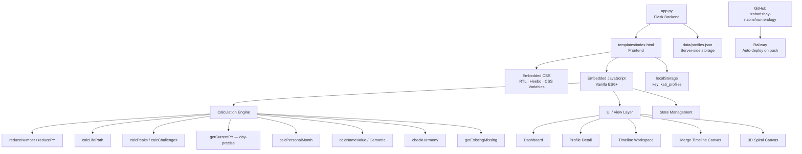
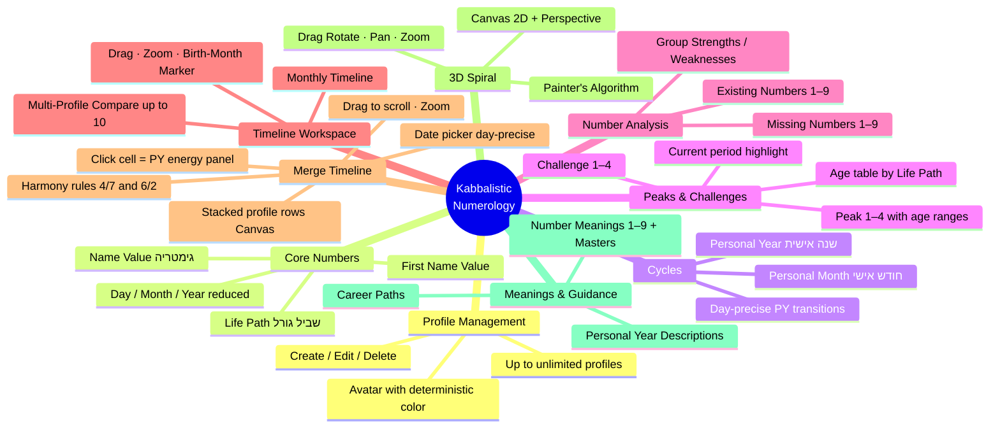
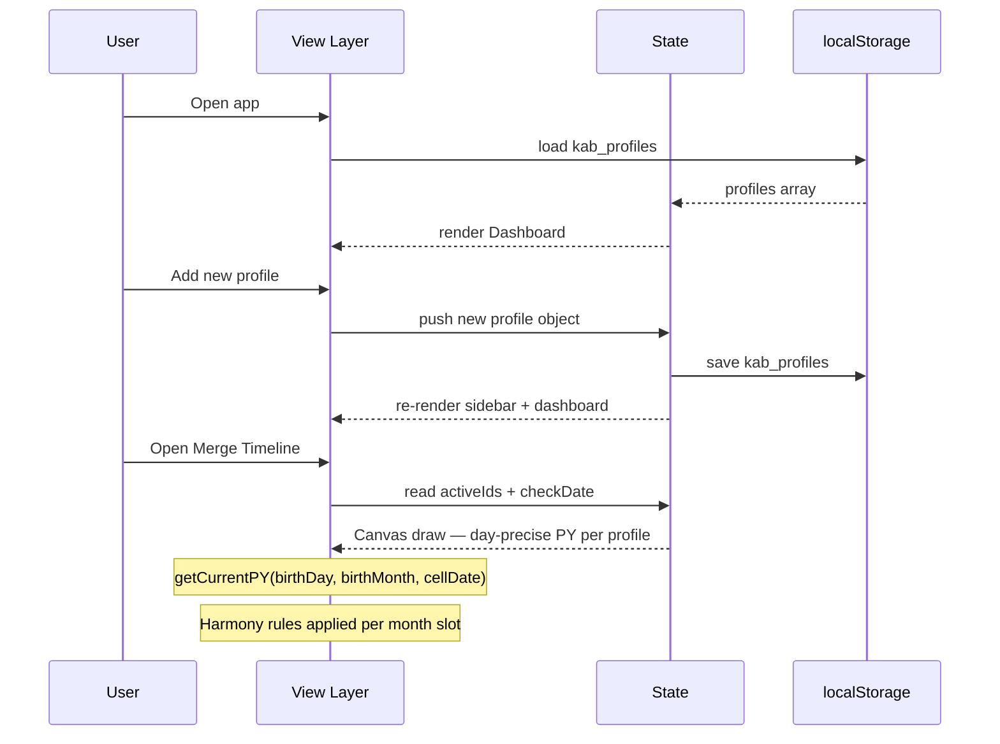

# Kabbalistic Numerology App

> A Hebrew numerology calculator based on **Kabbalistic** (not Pythagorean) principles. Flask backend + single-file frontend, deployed on Railway, accessible from any device.

---

## Table of Contents

1. [Overview](#overview)
2. [Architecture](#architecture)
3. [Feature Map](#feature-map)
4. [Calculation Engine](#calculation-engine)
   - [Core Reduction Rules](#core-reduction-rules)
   - [Life Path](#life-path)
   - [Personal Year & Month](#personal-year--month)
   - [Peaks & Challenges](#peaks--challenges)
   - [Existing & Missing Numbers](#existing--missing-numbers)
   - [Name–Date Harmony](#namedate-harmony)
5. [Data Flow](#data-flow)
6. [Views](#views)
   - [Dashboard](#dashboard)
   - [Profile Detail](#profile-detail)
   - [Timeline Workspace](#timeline-workspace)
   - [Merge Timeline](#merge-timeline)
   - [3D Spiral](#3d-spiral)
7. [Personal Year Color System](#personal-year-color-system)
8. [Merge Harmony Rules](#merge-harmony-rules)
9. [Hebrew Gematria Table](#hebrew-gematria-table)
10. [Master Numbers](#master-numbers)
11. [Number Meanings Reference](#number-meanings-reference)
12. [Roadmap](#roadmap)
13. [Tech Stack](#tech-stack)

---

## Overview

This application provides a complete **Kabbalistic numerology** reading for any person based on their date of birth and Hebrew first name. It calculates all core numerological indicators, displays them in an RTL Hebrew interface, and lets practitioners manage multiple client profiles from a single dashboard.

**Key principles:**
- Kabbalistic system only (not Pythagorean)
- Master numbers `11`, `22`, `33` are **never reduced** in fate-path calculations
- Hebrew gematria for name values (final letters = same value as regular form)
- Data stored in `localStorage` (Supabase migration planned)
- Zero frontend dependencies (no React, no Vue, no jQuery)

**Live URL:** `https://abundant-beauty-production-4999.up.railway.app`

---

## Architecture



---

## Feature Map



---

## Calculation Engine

### Core Reduction Rules

| Function | Behaviour |
|---|---|
| `reduceNumber(n)` | Sum digits repeatedly until single digit **or** master (11 / 22 / 33) |
| `reducePY(n)` | Sum digits repeatedly until **1–9 only** (masters reduced) |
| `reduceYear(year)` | Sum 4 digits → `reduceNumber` |

### Life Path

```
d  = reduceNumber(birthDay)
m  = reduceNumber(birthMonth)
y  = reduceYear(birthYear)
LP = reduceNumber(d + m + y)
```

Master numbers are preserved at every intermediate step.

### Personal Year & Month

**Birth-month rule:**
- January–June → use `calYear` itself
- July–December → use `calYear + 1`

```
calcPYForBirthdayYear(birthDay, birthMonth, calYear):
  d  = reduceNumber(birthDay)
  m  = reduceNumber(birthMonth)
  y  = birthMonth <= 6 ? reduceYear(calYear) : reduceYear(calYear + 1)
  PY = reducePY(d + m + y)          ← always 1–9

getCurrentPY(birthDay, birthMonth, checkDate):
  lastBirthdayYear = checkDate >= birthday(checkDate.year)
                     ? checkDate.year
                     : checkDate.year - 1
  return calcPYForBirthdayYear(birthDay, birthMonth, lastBirthdayYear)

PersonalMonth = reducePY(personalYear + currentCalendarMonth)
```

> **Day precision:** PY transitions happen on the exact birthday, not January 1st.
> Two people can be in different Personal Years on the same calendar date.

### Peaks & Challenges

```mermaid
flowchart LR
    D[Day<br/>reduced] & M[Month<br/>reduced] & Y[Year<br/>reduced] & LP[Life Path]

    D & M --> P1[Peak 1<br/>d+m]
    D & Y --> P2[Peak 2<br/>d+y]
    D & LP --> P3[Peak 3<br/>d+LP]
    M & Y --> P4[Peak 4<br/>m+y]

    D & M --> C1[Challenge 1<br/>|d−m|]
    D & Y --> C2[Challenge 2<br/>|d−y|]
    C1 & C2 --> C3[Challenge 3<br/>|c1−c2|]
    M & Y --> C4[Challenge 4<br/>|m−y|]
```

**Peak age ranges by Life Path:**

| LP | Peak 1 | Peak 2 | Peak 3 | Peak 4 |
|---|---|---|---|---|
| 1 | 27–35 | 36–44 | 45–53 | 54–62 |
| 2 | 26–34 | 35–43 | 44–52 | 53–61 |
| 3 | 25–33 | 34–42 | 43–51 | 52–60 |
| 4 | 24–32 | 33–41 | 42–50 | 51–59 |
| 5 | 23–31 | 32–40 | 41–49 | 50–58 |
| 6 | 22–30 | 31–39 | 40–48 | 49–57 |
| 7 | 21–29 | 30–38 | 39–47 | 48–56 |
| 8 | 20–28 | 29–37 | 38–46 | 47–55 |
| 9 | 19–27 | 28–36 | 37–45 | 46–54 |

### Existing & Missing Numbers

Source: all digits in the string `"${day}${month}${year}"`.

- **Existing** — digits 1–9 that appear at least once
- **Missing** — digits 1–9 that do not appear

Groups (both existing-strengths and missing-weaknesses):

| Group | Theme |
|---|---|
| 1-2-3 | Order, logic, leadership |
| 4-5-6 | Dependence, nostalgia, sensuality |
| 7-8-9 | Persistence, independence, drive |
| 1-4-7 | Reliability, action over words |
| 2-5-8 | Social ease, emotional balance |
| 3-6-9 | Memory, logic, creativity |
| 1-5-9 | Judgment, problem-solving |
| 3-5-7 | Self-awareness, spirituality |

### Name–Date Harmony

Three numbers compared: `dayNum`, `lifePathNum`, `firstNameValue`.

Master normalisation: `11→2, 22→4, 33→6`.

Condition: at least 2 of 3 share a harmony group **and** the third differs by ≤ 2 from each.

---

## Data Flow



---

## Views

### Dashboard

Grid of profile cards, each showing:
- Avatar (initials + deterministic colour)
- Life Path, Personal Year badge
- Hover → edit / delete actions

### Profile Detail

Full reading for one person:
- Hero bar: Life Path, Personal Year, Personal Month
- Core numbers: day / month / year (raw + reduced)
- Peaks & Challenges pairs with current-period highlight and age ranges
- Existing / missing numbers chips
- Number meaning, career path, personal year description

### Timeline Workspace

Horizontal scrollable table — one row per person, one column per month.

- Each cell = colour-coded Personal Year block
- Pre-birth cells shown as hatched pattern
- Current month highlighted with ring
- Zoom controls, drag-to-scroll
- Profile picker (multi-select, up to 10)

### Merge Timeline

Canvas-based stacked visualization for multi-profile energy comparison.

- One row per selected profile (up to 10)
- **Date picker** — centers the timeline on any chosen date; PY calculated at day-level precision
- **Drag** to scroll through time, **scroll wheel** to zoom
- **Click any cell** → side panel shows the energy and meaning of that Personal Year
- **Merge row** at the bottom — marks harmony/conflict combinations (see rules below)
- Pre-birth slots rendered as diagonal hatch

### 3D Spiral

Canvas-based 3D helix (no WebGL, no libraries):

```
x = r · cos(angle)
y = −t · Y_RISE
z = r · sin(angle)
```

- Painter's algorithm depth sort
- Mouse drag → camera rotation
- Ctrl + drag → pan
- Scroll wheel → zoom
- Preset views: `top`, `perspective`, `side`

---

## Personal Year Color System

| PY | Color | Hex |
|---|---|---|
| 1 | Red | `#C0392B` |
| 2 | Purple | `#7D3C98` |
| 3 | Green | `#1E8449` |
| 4 | Red | `#C0392B` |
| 5 | Blue | `#1A5276` |
| 6 | Purple | `#7D3C98` |
| 7 | Gold | `#D4AC0D` |
| 8 | Red | `#C0392B` |
| 9 | Gold | `#D4AC0D` |
| 11 | Deep Purple | `#6C3483` |
| 22 | Deep Gold | `#B7950B` |
| 33 | Deep Purple | `#6C3483` |

**Color groups:**
- **Red** (1, 4, 8) — action, power, intensity
- **Purple** (2, 6) — emotion, relationships, intuition
- **Green** (3) — creativity, expression
- **Blue** (5) — freedom, movement
- **Gold** (7, 9) — spirituality, wisdom, completion

---

## Merge Harmony Rules

Applied per month slot in the Merge Timeline. Checks the Personal Years of all active profiles on the 1st of each month.

| Combination | Symbol | Color | Meaning |
|---|---|---|---|
| PY 4 + PY 7 | **!** | Red `#C0392B` | Danger — risk of rupture, fertility/livelihood/health issues. Can be resolved with a new ketubah. |
| PY 6 + PY 2 | **♥** | Purple `#7D3C98` | Harmony — good couple dynamics, emotional alignment. |
| All others | _(blank)_ | — | No special marking. |

> Master number normalisation applies: 11→2, 22→4, 33→6 before checking rules.

---

## Hebrew Gematria Table

| Letter | Value | | Letter | Value |
|---|---|---|---|---|
| א | 1 | | י | 10 |
| ב | 2 | | כ / ך | 20 |
| ג | 3 | | ל | 30 |
| ד | 4 | | מ / ם | 40 |
| ה | 5 | | נ / ן | 50 |
| ו | 6 | | ס | 60 |
| ז | 7 | | ע | 70 |
| ח | 8 | | פ / ף | 80 |
| ט | 9 | | צ / ץ | 90 |
|   |   | | ק | 100 |
|   |   | | ר | 200 |
|   |   | | ש | 300 |
|   |   | | ת | 400 |

> Final letters (sofit) carry the **same value** as their regular form.

---

## Master Numbers

| Number | Reduced to | Context |
|---|---|---|
| 11 | preserved | Life path, peaks, challenges |
| 22 | preserved | Life path, peaks, challenges |
| 33 | preserved | Life path, peaks, challenges |
| 11/22/33 | 2 / 4 / 6 | Personal Year, Personal Month (`reducePY`) |
| 11/22/33 | 2 / 4 / 6 | Harmony group normalisation |
| 11/22/33 | 2 / 4 / 6 | Merge harmony rule normalisation |

---

## Number Meanings Reference

| # | Core Trait |
|---|---|
| 1 | Leadership, independence, decisiveness |
| 2 | Emotion, partnership, sensitivity |
| 3 | Creativity, expression, romance |
| 4 | Discipline, perfectionism, structure |
| 5 | Freedom, travel, charisma |
| 6 | Family, harmony, warmth |
| 7 | Spirituality, intuition, guidance |
| 8 | Authority, abundance, balance of matter & spirit |
| 9 | Verbal power, justice, prophecy |
| 11 | Master 2 — heightened sensitivity & intuition |
| 22 | Master 4 — builder of great visions |
| 33 | Master 6 — unconditional love & giving |

---

## Roadmap

- [x] Railway deployment — accessible from any device
- [x] GitHub repository connected
- [x] Merge Timeline — Canvas-based, day-precise
- [x] Harmony rules — 4/7 danger, 6/2 harmony
- [x] Personal Year color system defined
- [ ] Supabase — user accounts, cloud profiles
- [ ] Login / authentication
- [ ] Mobile-responsive layout
- [ ] PWA — "Add to Home Screen" on iPhone
- [ ] Peaks age ranges displayed in profile detail
- [ ] Additional merge harmony rules
- [ ] PDF export of full reading
- [ ] RAG knowledge base with pgvector

---

## Tech Stack

| Layer | Technology |
|---|---|
| Frontend | HTML5 + Vanilla CSS + Vanilla JS ES6+ |
| Font | Heebo (Google Fonts) |
| Graphics | HTML5 Canvas 2D |
| Backend | Python / Flask |
| Storage (current) | localStorage + `data/profiles.json` |
| Storage (planned) | Supabase PostgreSQL + pgvector |
| Auth (planned) | Supabase Auth |
| Hosting | Railway |
| Repository | GitHub — `tzabarishay-naomi/numerology` |
